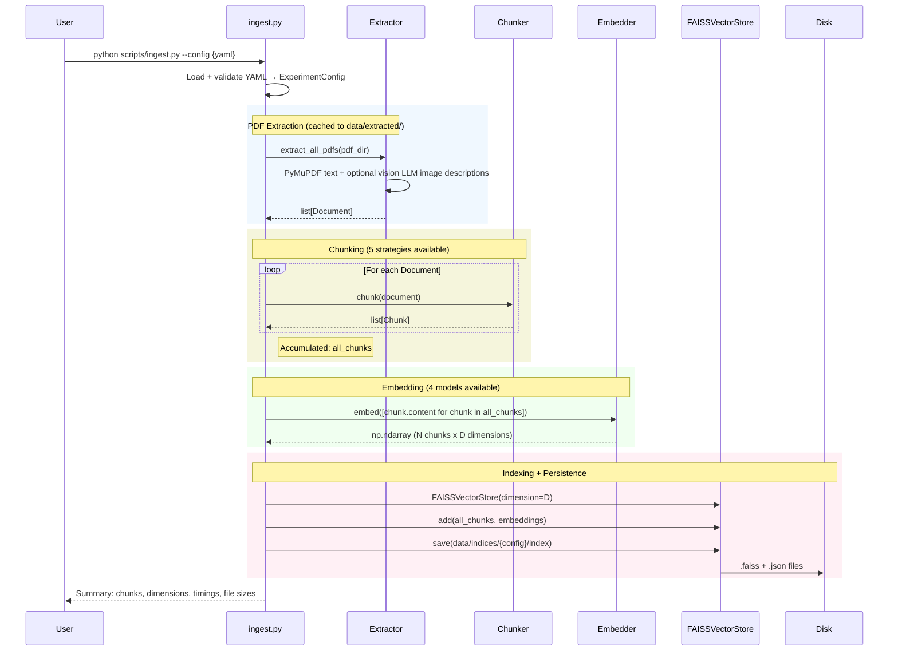
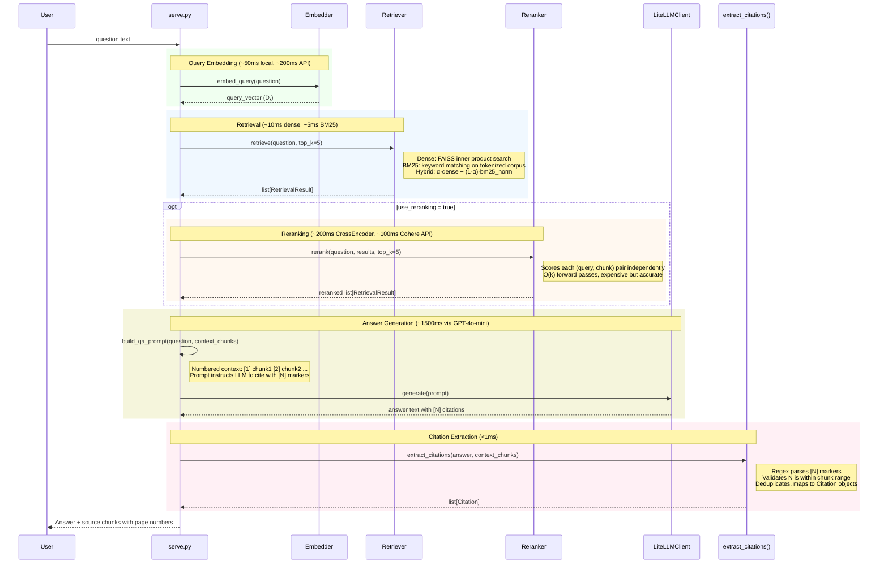

# ShopTalk Knowledge Management Agent

I built a RAG system from scratch to answer questions about academic papers. No LangChain. Every component (chunkers, embedders, retrievers, rerankers, generator) hides behind an ABC interface and swaps through YAML config.

I tested 46 configurations across a grid: 5 chunking strategies, 4 embedding models, 3 retrieval methods, 2 rerankers. The best pipeline hit NDCG@5 = 0.896 and Recall@5 = 1.0. The LLM judge averaged 4.77/5.0 across 5 quality axes.

In P2, I measured RAG quality gaps (0.747 Recall@5 but only 0.511 faithfulness). P5 closes that gap. 7 sessions, ~30h, 7 ADRs, 627 tests.

## Key Results

Best config: `heading_semantic_openai_dense` (heading-aware chunks + OpenAI embeddings + dense retrieval).

| Metric | Value | Target | Status |
|--------|-------|--------|--------|
| NDCG@5 | 0.896 | > 0.75 | Pass |
| Recall@5 | 1.000 | > 0.80 | Pass |
| MRR | 0.907 | > 0.70 | Pass |
| LLM Judge (5-axis avg) | 4.77 / 5.0 | > 4.0 | Pass |
| Precision@5 | 0.300 | > 0.60 | Fail |

Precision@5 misses the target because ground truth is sparse: each query has 1-3 gold chunks, so 5 retrieved results can't all be relevant. I verified reproducibility by running the best config twice. 0% variance on all 4 metrics.

**Live Dashboard:** Deploying after all 9 projects complete. Link will be added here.

## Architecture

Two pipelines (ingestion and query) share the same components through a factory pattern. Each component hides behind an ABC, so the factory maps a config string to a concrete class. Full class hierarchy in [docs/architecture/class-diagram.md](docs/architecture/class-diagram.md). Entry point map in [docs/architecture/system-context.md](docs/architecture/system-context.md).

### Ingestion Pipeline



### Query Pipeline



### Architecture Diagrams

| Diagram | What it shows | File |
|---------|--------------|------|
| Class Hierarchy | 6 ABCs, 17 implementations, factory pattern | [class-diagram.md](docs/architecture/class-diagram.md) |
| Ingestion Pipeline | PDF → Document → Chunks → Embeddings → FAISS index | [ingestion-sequence.md](docs/architecture/ingestion-sequence.md) |
| Query Pipeline | Question → Embed → Retrieve → Rerank → Generate → Citations | [query-sequence.md](docs/architecture/query-sequence.md) |
| System Context | 4 entry points, external service dependencies, failure modes | [system-context.md](docs/architecture/system-context.md) |

## Findings

I evaluated all 46 configs against 18 curated queries on 4 academic papers (Attention Is All You Need, BERT, RAG survey, Sentence-BERT).

| Experiment | Result | Data |
|-----------|--------|------|
| Chunking strategy | `heading_semantic` wins. Preserves section boundaries. | 0.7752 avg NDCG@5 vs 0.6874 for embedding_semantic |
| Retrieval method | Hybrid beats dense on average. Best single config is dense-only. | Hybrid: 0.7515 vs Dense: 0.7176 vs BM25: 0.7023 |
| Reranking | +0.1124 avg NDCG@5. Zero regressions across all 8 configs. | MRR improved +0.1473. CrossEncoder and Cohere within 0.01. |
| Embedding model | OpenAI dominates. mpnet trails MiniLM despite 2x dimensions. | OpenAI: 0.8288, MiniLM: 0.7052, mpnet: 0.6835 |
| Local vs API | Ollama competitive with mpnet at $0 cost. | Best Ollama: 0.757, hybrid boosts +0.09 to +0.12 |

<p align="center">
  
</p>

The embedding model rows cluster tightly regardless of chunking config. Vertical bands show that embedding choice moves the needle far more than chunk strategy.

<p align="center">
  
</p>

Every config improved with reranking. The weakest configs got the biggest lift, which suggests reranking partially compensates for bad chunking or weak embeddings.

<p align="center">
  
</p>

Ollama nomic-embed-text (768d, $0) closes 78% of the quality gap between mpnet and OpenAI. Hybrid retrieval boosts every Ollama config.

### What the numbers mean

Heading-aware chunking wins because academic papers have meaningful section structure. Fixed-size chunking breaks mid-sentence across section boundaries. Heading-semantic respects the author's organization. The gap is +0.088 NDCG@5 averaged across all embedder/retriever combos. It holds regardless of which embedding model I paired it with.

Hybrid retrieval's advantage is statistical, not universal. It wins on average (0.7515 vs 0.7176 dense) but the single best config uses dense-only. This surprised me. If I were picking production defaults for diverse queries, I'd choose hybrid. If I had a high-quality embedder (OpenAI) and could tune per-workload, dense is sufficient. The "best average" and "best possible" configs are different pipelines.

Reranking is the closest thing to a free lunch in this pipeline. +0.11 NDCG@5, zero regressions across all 8 configs I tested, ~200ms latency cost. The cross-encoder re-scores each (query, chunk) pair with full bidirectional attention. What bi-encoders sacrifice for speed at retrieval time, rerankers recover at the end. The only reason the best config doesn't use reranking is that I tested reranking on recursive chunking (to isolate the reranker effect), not on the best chunker.

Embedding training data matters more than dimensionality. Same finding as P2. mpnet (768d) doesn't beat MiniLM (384d) proportionally. If dimensions were the driver, mpnet should sit between MiniLM and OpenAI. It doesn't. I think OpenAI's supervised training data is doing the work, not the extra dimensions.

Local embeddings (Ollama nomic-embed-text, $0) close 78% of the quality gap between mpnet and OpenAI. Best Ollama NDCG@5 is 0.757 vs mpnet's 0.823 vs OpenAI's 0.896. For development iteration or cost-sensitive production, the data says local is viable. Hybrid retrieval boosted every Ollama config I tested by +0.04 to +0.12 NDCG@5.

## Architecture Decisions

| ADR | Title | Key Trade-off |
|-----|-------|---------------|
| [001](docs/adr/ADR-001-faiss-over-chromadb-for-experiment-vector-index.md) | FAISS over ChromaDB | Full isolation per experiment vs manual metadata handling |
| [002](docs/adr/ADR-002-no-langchain-first-principles-rag-with-abcs.md) | No LangChain: first-principles RAG with ABCs | Full control + swappability vs more boilerplate |
| [003](docs/adr/ADR-003-hybrid-retrieval-with-min-max-score-fusion.md) | Hybrid retrieval with min-max score fusion | BM25 [0,inf) normalized to [0,1] before fusion |
| [004](docs/adr/ADR-004-litellm-over-raw-openai-sdk.md) | LiteLLM over raw OpenAI SDK | One API for all providers vs extra dependency |
| [005](docs/adr/ADR-005-yaml-pydantic-experiment-configs.md) | YAML + Pydantic for experiment configs | Human-editable configs with cross-field validation |
| [006](docs/adr/ADR-006-pdf-extraction-with-vision-llm-image-descriptions.md) | PDF extraction with vision LLM image descriptions | +9K chars from figure descriptions vs $0.01 cost |
| [007](docs/adr/ADR-007-local-vs-api-embeddings.md) | Local vs API embeddings (Ollama nomic-embed-text) | $0 cost + privacy vs -0.14 NDCG@5 quality gap |

## Tech Stack

| Component | Library | Why this one |
|-----------|---------|-------------|
| PDF extraction | PyMuPDF (fitz) | Direct access to text blocks, image bounding boxes, and page dict. No wrapper overhead. |
| Vision LLM | GPT-4o-mini | Describes figures/diagrams in PDFs. Cached to disk, so the $0.01 cost is one-time. |
| Embeddings (local) | SentenceTransformers (MiniLM, mpnet) | Two local models at different dimensions to test the size-vs-quality question. |
| Embeddings (local) | Ollama nomic-embed-text | 768d local embeddings at $0 cost. Competitive with mpnet on 3 of 6 configs. |
| Embeddings (API) | OpenAI text-embedding-3-small | Best quality (NDCG@5 = 0.8288 avg). 1536d. ~$0.008/run. |
| Vector search | FAISS (IndexFlatIP) | Exact brute-force search. Under 1K vectors, approximate methods add complexity for no speed gain. |
| Keyword search | rank-bm25 | Lightweight BM25 baseline. No index server needed. |
| Reranking | Cohere rerank-v3.5, CrossEncoder | Cross-encoder reranking. Both gave +0.11 NDCG@5 lift. Cohere is API, CrossEncoder is local. |
| LLM routing | LiteLLM | Provider-agnostic wrapper. Swap OpenAI for Anthropic without changing pipeline code. |
| Structured output | Instructor | Auto-retry on validation failure. No manual JSON parsing. |
| Token counting | tiktoken | Accurate token counts for chunk size enforcement. Matches OpenAI's tokenizer. |
| Configuration | YAML + Pydantic | Human-editable configs with cross-field validation at load time. Adding a config is one YAML file. |
| CLI | Click + Rich | Three commands (ingest, serve, evaluate). Rich for progress bars and formatted output. |
| Web UI | Streamlit | Upload PDFs, configure pipeline, ask questions. Five panels. |
| Visualization | Matplotlib + Seaborn | 11 static charts for the README and experiment analysis. Git-trackable PNGs. |
| Testing | pytest + pytest-cov | 627 tests, 97% coverage. Mocks for all external APIs. |

## Quick Start

```bash
git clone https://github.com/rubsj/ai-shoptalk-knowledge-agent.git
cd ai-shoptalk-knowledge-agent
uv sync
cp .env.example .env  # Add OPENAI_API_KEY and COHERE_API_KEY
```

```bash
# Build a FAISS index for one config (~30s with MiniLM, ~5s cached)
python scripts/ingest.py --config experiments/configs/01_fixed_minilm_dense.yaml
# → Creates data/indices/01_fixed_minilm_dense/index.faiss + index.json

# Interactive Q&A: type a question, get a cited answer
python scripts/serve.py --config experiments/configs/01_fixed_minilm_dense.yaml
# → REPL loop. Type 'quit' to exit.

# Run the full experiment grid (~45min first run, ~15min cached)
# Subsequent runs use MD5-keyed JSON cache in data/cache/
python scripts/evaluate.py
# → 46 JSON results in results/experiments/, charts in results/charts/

# Web UI
streamlit run src/streamlit_app.py
# → Opens browser at localhost:8501

# Run tests
pytest  # 627 tests, 97% coverage
```

Optional: local embeddings with Ollama (free, no API key needed):

```bash
brew install ollama
ollama serve &
ollama pull nomic-embed-text
python scripts/ingest.py --config experiments/configs/47_heading_ollama_dense.yaml
# → Same flow, zero API cost. ~26s for 515 chunks (sequential REST calls).
```

Required API keys: `OPENAI_API_KEY` (embeddings + generation), `COHERE_API_KEY` (reranking, free tier works). Ollama configs need no keys.

## Known Gaps

**Precision@5 fails the target.** Each query has 1-3 gold chunks, so retrieving 5 results means at most 60% can be relevant. A denser annotation scheme (more gold chunks per query) would fix this. The metric isn't broken, the ground truth is sparse.

**Only tested on text-native academic PDFs.** 3 of 4 papers (BERT, RAG, Sentence-BERT) are two-column and extraction handles them fine. But all 4 are text-native PDFs, not scanned images. Scanned or OCR-dependent documents would need a different extraction pipeline. PyMuPDF's `get_text("dict")` relies on embedded text layers.

**18 evaluation queries is directionally useful but not statistically robust.** Enough to show clear winners (heading-semantic + OpenAI consistently tops every comparison) but confidence intervals are wide. Production eval needs 100+ queries with human-verified ground truth.

**LLM judge scores run high.** Citation Quality averaged 4.72/5.0 from the judge. Manual spot-checks suggest ~4.0 would be more accurate. The calibration offset is documented in `results/judge_calibration_input.json` but not corrected for in the reported scores.

**No hybrid retrieval in serve/streamlit by default.** The experiment runner tests hybrid retrieval across the full grid, but `serve.py` and `streamlit_app.py` use whichever retriever type the config specifies. Changing to hybrid requires editing the YAML config, not a UI toggle.

## Project Structure

```
├── scripts/
│   ├── ingest.py              # PDF → chunk → embed → FAISS index
│   ├── serve.py               # Interactive Q&A REPL
│   └── evaluate.py            # Run experiment grid, save results
├── src/
│   ├── interfaces.py          # 6 ABCs (BaseChunker, BaseEmbedder, ...)
│   ├── factories.py           # Config string → concrete instance
│   ├── schemas.py             # Pydantic models (Document, Chunk, ExperimentConfig, ...)
│   ├── extraction.py          # PyMuPDF + vision LLM image descriptions
│   ├── generator.py           # LiteLLMClient + prompt building + citation extraction
│   ├── vector_store.py        # FAISSVectorStore (add, search, save, load)
│   ├── experiment_runner.py   # Grid orchestrator, pools by embedding model
│   ├── reporting.py           # Comparison report + iteration log generation
│   ├── visualization.py       # 11 chart types (heatmap, radar, scatter, ...)
│   ├── streamlit_app.py       # 5-panel Streamlit UI
│   ├── chunkers/              # Fixed, Recursive, SlidingWindow, HeadingSemantic, EmbeddingSemantic
│   ├── embedders/             # MiniLM, mpnet, OpenAI, Ollama
│   ├── retrievers/            # Dense, BM25, Hybrid (composes Dense + BM25)
│   ├── rerankers/             # CrossEncoder, Cohere
│   └── evaluation/            # Metrics, LLM Judge, Ground Truth
├── experiments/configs/       # 46 YAML experiment configurations
├── data/
│   ├── pdfs/                  # Source academic papers
│   ├── indices/               # FAISS indices (per config)
│   ├── cache/                 # LLM response cache (MD5 keyed)
│   └── ground_truth.json      # 18 curated queries with relevance grades
├── results/
│   ├── experiments/           # 46 JSON result files
│   ├── charts/                # 11 visualization PNGs
│   ├── comparison_report.md   # Full experiment analysis
│   └── iteration_log.json     # 114 traceable config changes
├── docs/
│   ├── adr/                   # 7 Architecture Decision Records
│   └── architecture/          # 4 Mermaid architecture diagrams
└── tests/                     # 627 tests, 97% coverage
```

---

Part of a [9-project AI engineering sprint](https://github.com/rubsj/ai-portfolio). Built Feb–May 2026.

Built by **Ruby Jha** · [LinkedIn](https://linkedin.com/in/jharuby) · [GitHub](https://github.com/rubsj/ai-portfolio)
