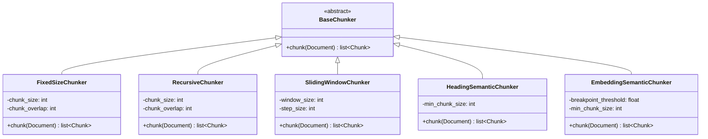
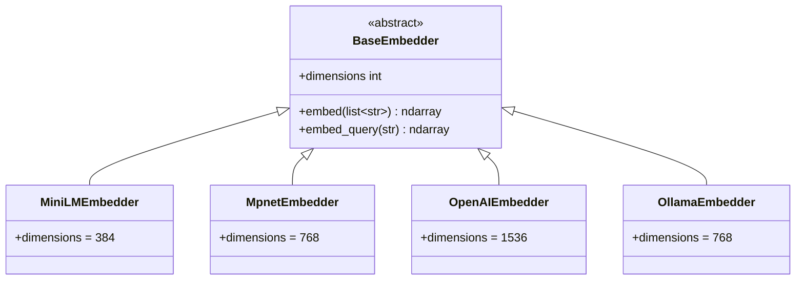
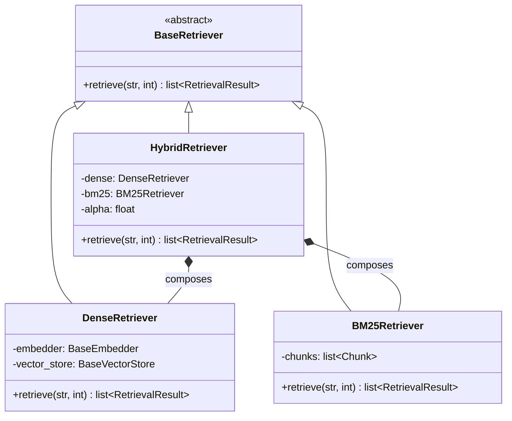
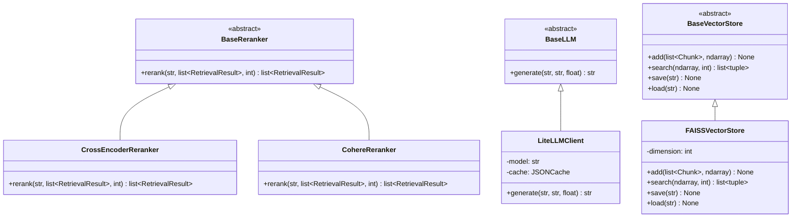
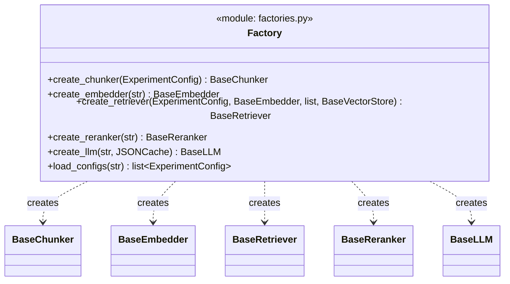

# Component Class Hierarchy

Every pipeline component hides behind an ABC. Callers never import concrete classes — they call a factory function with a config string and get back the right implementation. I used the same pattern in Java with static factory methods that switch on a discriminator field, except Python enforces the contract at runtime (`@abstractmethod` raises `TypeError` on instantiation) rather than at compile time.

Splitting the diagram by component group because a single 20-class Mermaid block is unreadable.

## Chunking

Five strategies, all producing `list[Chunk]` from a `Document`. The parameters that differ between them (fixed size vs window/step vs heading detection vs embedding similarity) are the whole reason the ABC exists — the caller shouldn't care how chunks are produced, only that they conform to the `Chunk` schema.

## Embedding

Four models spanning local CPU inference (MiniLM, mpnet), local GPU via Ollama REST API (nomic), and cloud API (OpenAI). The `dimensions` property matters because FAISS index dimension is set at creation time — you can't mix 384d and 768d vectors in the same index.

## Retrieval

The interesting piece here is `HybridRetriever`. It doesn't just inherit from `BaseRetriever` — it *composes* a `DenseRetriever` and `BM25Retriever` internally, runs both, normalizes BM25's unbounded scores to [0,1] via min-max, then fuses with `α·dense + (1-α)·bm25_norm`. The caller sees a single `retrieve()` call. This is the Composite pattern — same idea as Java's `CompositeService` where the composite owns its delegates.

## Reranking, Generation, and Storage

Rerankers are the most expensive component per-query — CrossEncoder scores each (query, chunk) pair independently, so it's O(k) forward passes vs a bi-encoder's single pass. That's why reranking only applies to the top-k from retrieval, never the full corpus.

`LiteLLMClient` wraps any provider (OpenAI, Anthropic, Cohere) behind one `generate()` call. The `JSONCache` avoids re-calling the API for identical prompts during experiment reruns — saved roughly $12 across the full grid.

## Factory Pattern

The factory is a Python module, not a class — five standalone functions that map config strings to concrete instances. In Java terms, this is closer to a static factory method with a `switch` on the discriminator, not Spring's `@Component` autowiring. The key property: changing `embedding_model: "minilm"` to `"openai"` in a YAML file produces a completely different pipeline with zero code changes.

