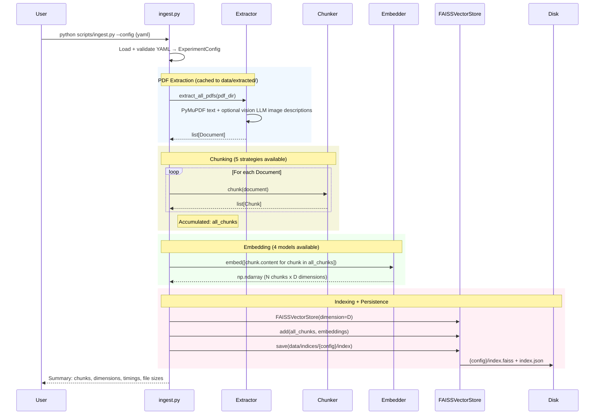

# Ingestion Pipeline

PDF documents go through four stages: extract text, split into chunks, embed into vectors, and index into FAISS. Each experiment config produces its own isolated index in `data/indices/{config_stem}/` — this prevents cross-contamination between experiment runs, so config A's index never leaks into config B's retrieval results.

The vision LLM path in extraction is optional: PyMuPDF pulls raw text from every page, but some PDFs have figures or diagrams with meaningful content. When enabled, a vision model (GPT-4o) generates text descriptions of embedded images, which get appended to the page text before chunking. I kept this off for the experiment grid (academic papers are text-heavy) but it's wired up for future use with diagram-heavy documents.

## Data Flow

| Stage | Input | Output | Key Type |
|-------|-------|--------|----------|
| Extract | PDF files | `list[Document]` | `Document(id, content, metadata)` |
| Chunk | `Document` | `list[Chunk]` | `Chunk(id, content, metadata)` — metadata carries `start_char`, `end_char`, `page_number` |
| Embed | `list[str]` | `np.ndarray` | Shape: (N, D) — L2-normalized so inner product = cosine similarity |
| Index | chunks + embeddings | FAISS index | `IndexFlatIP` — exact search, not approximate. Deterministic results for reproducibility. |
| Save | index + metadata | disk files | `.faiss` (raw vectors) + `.json` (chunk content + metadata for reconstruction) |
