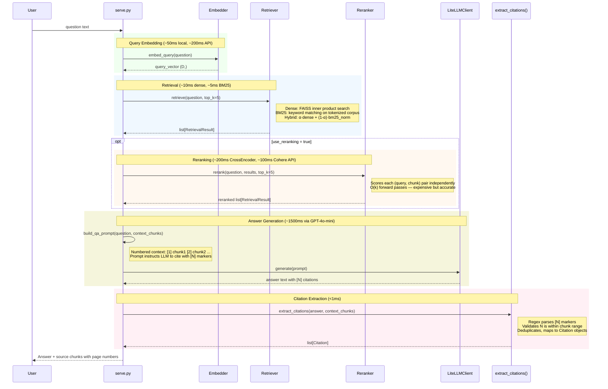

# Query Pipeline

A user question flows through embedding, retrieval, optional reranking, LLM generation, and citation extraction. The full chain runs in under 3 seconds for the best config — most of that time is the LLM generation call, not retrieval.

The `opt` block for reranking is the most interesting architectural choice here. Reranking improved NDCG@5 by +0.1124 on average across all 8 configs tested, but added ~200ms latency per query. Every single config that added reranking improved — zero regressions. That made the trade-off obvious for quality-first deployments.

## Data Flow

| Stage | Input | Output | Key Type |
|-------|-------|--------|----------|
| Embed query | `str` | `np.ndarray` | Shape: (D,) — L2-normalized, same space as indexed chunks |
| Retrieve | query + top_k | `list[RetrievalResult]` | `RetrievalResult(chunk, score, retriever_type, rank)` |
| Rerank | query + results + top_k | `list[RetrievalResult]` | Re-scored by cross-encoder, reordered by new scores |
| Generate | prompt with numbered context | `str` | Answer with `[N]` citation markers referencing context chunks |
| Extract citations | answer + chunks | `list[Citation]` | `Citation(chunk_id, source, page_number, text_snippet)` |

## Latency Budget (best config, heading_semantic + openai + dense)

| Stage | Time | % of Total |
|-------|------|-----------|
| Query embedding | ~200ms | ~7% |
| FAISS retrieval | ~10ms | <1% |
| Reranking (if enabled) | ~200ms | ~7% |
| LLM generation | ~1500ms | ~85% |
| Citation extraction | <1ms | <1% |
| **Total (no reranking)** | **~1700ms** | |
| **Total (with reranking)** | **~1900ms** | |
