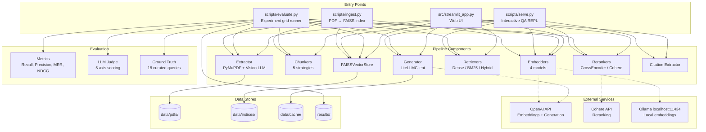

# System Context

Four entry points exist because each serves a different workflow: `ingest.py` for offline indexing, `serve.py` for interactive Q&A, `evaluate.py` for batch experimentation, and `streamlit_app.py` for a demo-friendly web interface. They all compose the same pipeline components through the factory pattern — no entry point has its own retrieval or generation logic.

Solid lines in the diagram are internal component dependencies. Dashed lines are external service calls that can fail — and each failure mode is handled differently. OpenAI down means no generation (fatal for serve/streamlit, skippable for evaluate). Cohere down means no reranking (graceful degradation — retrieval still works, just unranked). Ollama down means `OllamaUnavailableError` at embedder creation — the experiment runner skips those configs and continues the grid.

## Entry Point Summary

| Entry Point | Command | What it does | Components Used |
|-------------|---------|--------------|-----------------|
| `ingest.py` | `python scripts/ingest.py --config {yaml}` | Builds a FAISS index from PDFs for a specific config | Extractor → Chunker → Embedder → VectorStore |
| `serve.py` | `python scripts/serve.py --config {yaml}` | Interactive Q&A — type a question, get a cited answer | Embedder, VectorStore, Retriever, Reranker, Generator, Citations |
| `evaluate.py` | `python scripts/evaluate.py --configs {dir}` | Runs the full experiment grid across all configs | Everything — this is the batch orchestrator |
| `streamlit_app.py` | `streamlit run src/streamlit_app.py` | Web UI: upload PDFs, configure pipeline, ask questions | Everything except Metrics/Judge/GroundTruth |

## External Dependencies

| Service | What it does | Cost | Failure mode |
|---------|-------------|------|-------------|
| OpenAI API | `text-embedding-3-small` (1536d) embeddings + `gpt-4o-mini` generation | ~$0.04/experiment run | Fatal for generation. Embedder configs using OpenAI skip; other embedders unaffected. |
| Cohere API | Reranking via `rerank-v3.5` | ~$0.001/query | Graceful — retrieval works without reranking, results just aren't reordered. |
| Ollama | `nomic-embed-text` (768d) local embeddings via REST | $0 | `OllamaUnavailableError` at init. Runner skips Ollama configs, continues grid. |
